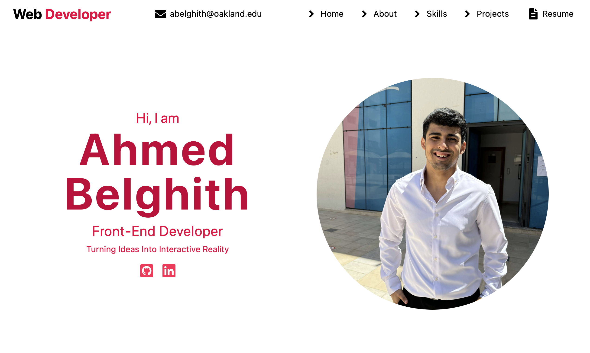

## 🎯 About

Hi, I'm Ahmed Belghith 👋

Welcome to my portfolio! This website showcases my projects and skills as a full-stack developer. I built it using React, Tailwind CSS, and GSAP for smooth animations.

---

## ▶️ ScreenShot

Here’s a preview of the portfolio:



## :rocket: Features

- **Responsive Design:** Looks great on any device.
- **Animated Interactions:** Smooth hover and scroll animations.
- **Project Showcases:** Detailed view of my work.
- **Contact Section:** Get in touch with me easily.


## 🌟 Demo
Here you can find the demo link: https://whimsical-stroopwafel-495f96.netlify.app

## 👨🏻‍💻 Run Locally

Follow these steps to run the project locally:

1. **Clone the repository:**

   ```bash
   git clone https://github.com/AhmedBelghith24/portfolio.git 

1. **Navigate to the project directory:**
     ```bash
     cd portfolio
 
2. **Install dependencies:**
   ```bash
   npm install

5. **Start the development server:**
   This launches your app locally so you can view it in your browser.
     ```bash
     npm run dev
  Open http://localhost:3000 in your browser to view the project.
